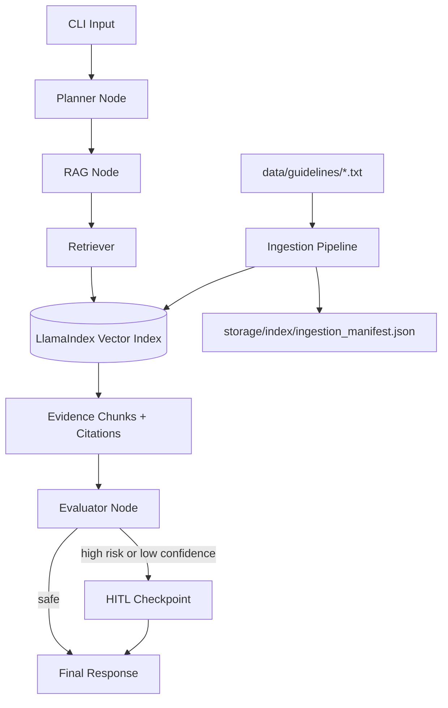

# Final Project Architecture Diagram

```mermaid
flowchart TD
    A[CLI Input] --> B[Planner Node]
    B --> C[RAG Node]
    C --> D[Retriever]
    D --> E[(LlamaIndex Vector Index)]
    E --> F[Evidence Chunks + Citations]
    F --> G[Evaluator Node]
    G -->|high risk or low confidence| H[HITL Checkpoint]
    G -->|safe| I[Final Response]
    H --> I

    J[data/guidelines/*.txt] --> K[Ingestion Pipeline]
    K --> E
    K --> L[storage/index/ingestion_manifest.json]
```
